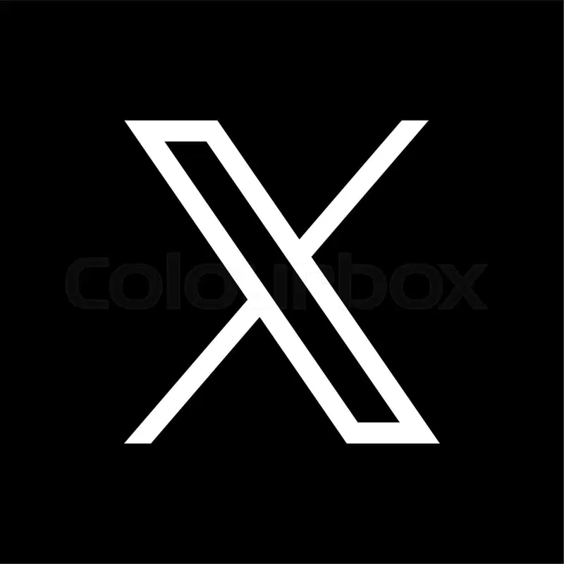
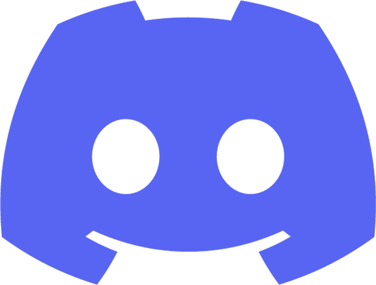

# Partners

Below is a list of partner projects collaborating with IronMON. 
Each project contributes to the ecosystem by providing unique components for robot NFTs.

More and more projects are coming to IronMON!

| Logo | Project Name | Website | Twitter | Discord | Description |
|------|--------------|---------|---------|---------|-------------|
|  | LootGo | [https://www.lootgo.app/](https://www.lootgo.app/) |  |  | LootGo is a Web3 game where players can enjoy adventures and earn rewards. |
|  | TowneSquare | [https://www.townesquare.xyz/](https://www.townesquare.xyz/) |  |  | TowneSquare is a dApp that simplifies onboarding for Web3 users. |
|  | Meta Leap | [https://metaleap.io/](https://metaleap.io/) |  |  | Meta Leap is a metaverse platform offering virtual reality experiences and interactions. |
|  | Nad.fun | [https://land.nad.fun/](https://land.nad.fun/) |  | | Nad.fun is a platform for buying and selling land NFTs in the metaverse. |
|  | Narwhal Finance | [https://narwhal.finance/](https://narwhal.finance/) |  |  | Narwhal Finance is a decentralized exchange and liquidity protocol on the blockchain. |
|  | Mozi | [https://www.mozi.finance/](https://www.mozi.finance/) |  |  | Mozi Finance is a decentralized yield farming and staking platform where users can earn passive income from crypto assets. |
|  | Tezza Poker | | | | Tezza Poker is a poker game dApp on the Monad testnet, allowing users to play and interact with the community. |
|  | PancakeSwap | [https://pancakeswap.finance/](https://pancakeswap.finance/) |  |  | PancakeSwap is a decentralized exchange on the BNB Chain, offering swap, staking, and yield farming services. |